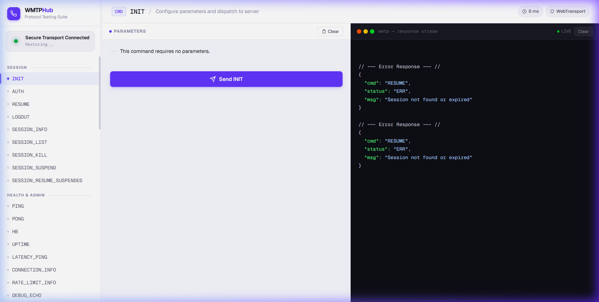
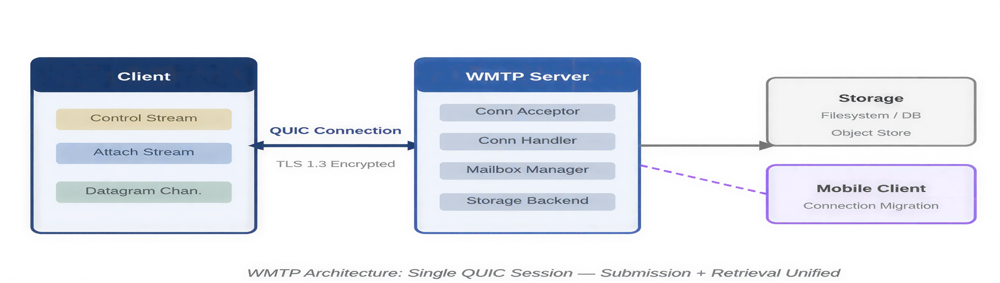
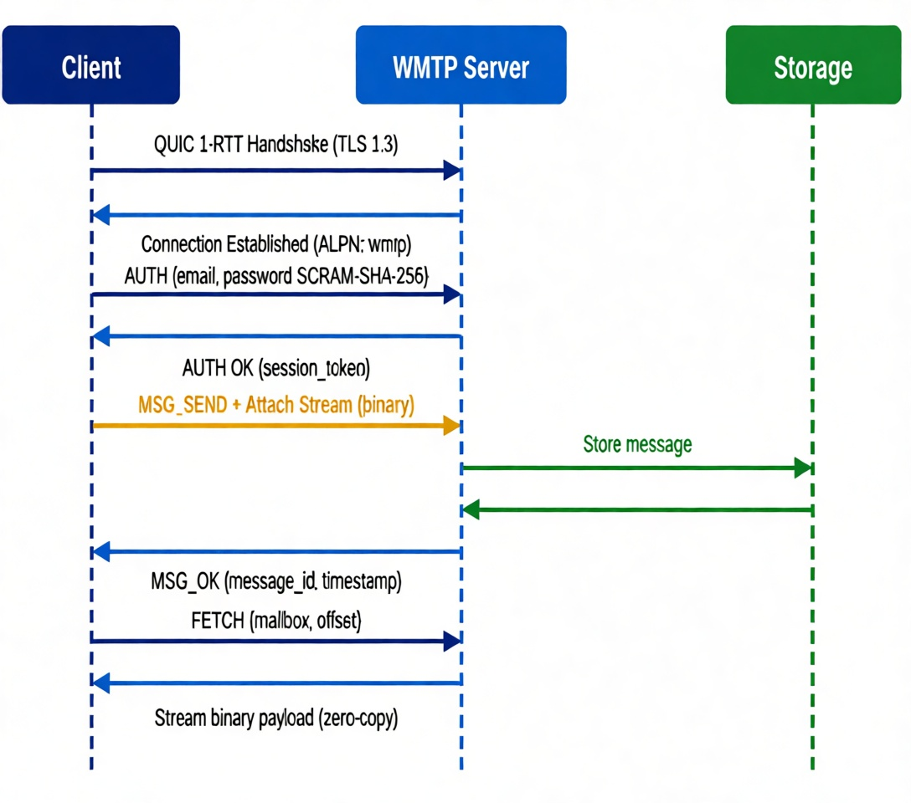
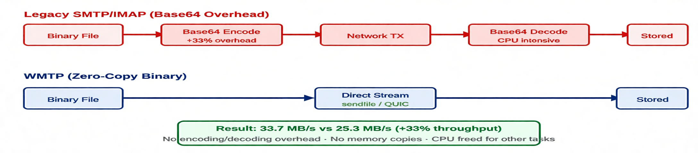
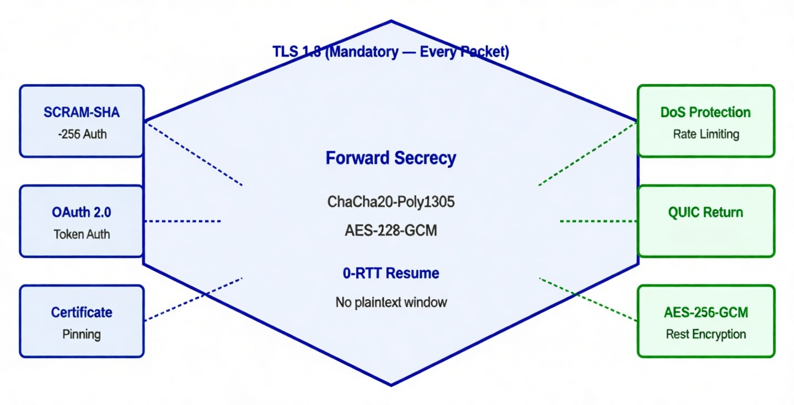
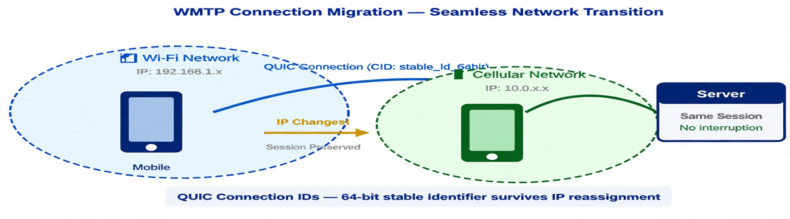
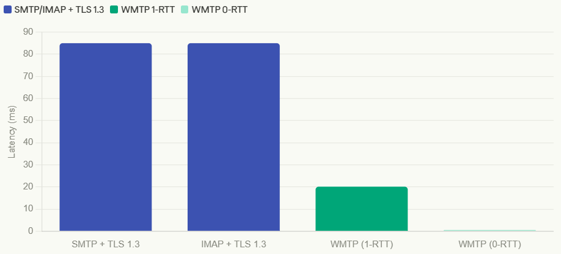
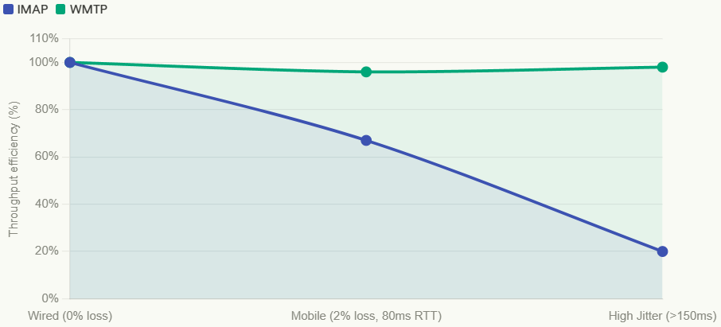
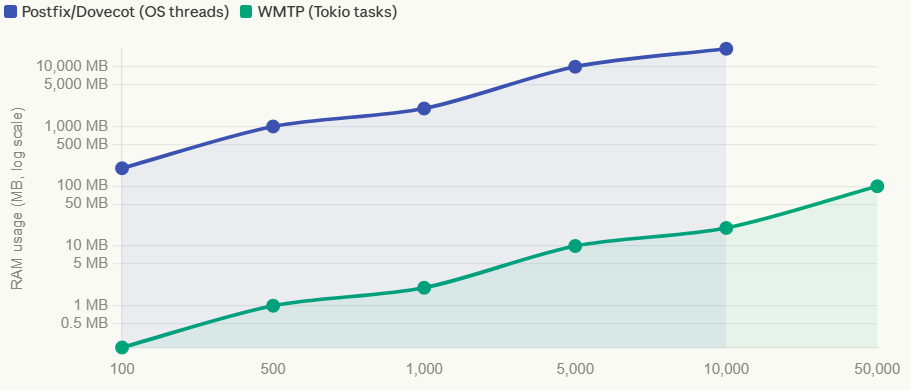

# WMTP - WebTransport Mail Transfer Protocol


A next-generation, secure, low-latency email transfer protocol built on **QUIC** and **WebTransport**. WMTP unifies message submission and retrieval into a single, encrypted, stateful connection, eliminating Head-of-Line (HoL) blocking and high handshake latency.

---

## 📸 Console Preview

The WMTP Protocol Testing Suite provides a premium, real-time interface for interacting with the Rust server.



---

## ✨ Key Features

- 🚀 **QUIC-Powered** - Native multiplexing via independent data streams (eliminates HoL blocking).
- 🦀 **Rust Core** - High-performance, memory-safe backend built with `tokio` and `wtransport`.
- 🔒 **Always Encrypted** - Mandatory TLS 1.3 with 1-RTT connection establishment (~4.2x faster than SMTP/IMAP).
- 📁 **Dual-Plane Architecture** - Dedicated planes for JSON Control (Low-latency) and Raw Binary Data (High-throughput).
- ⚡ **O(1) Memory Streaming** - Zero-copy attachment handling directly to MongoDB GridFS.
- 📱 **Connection Migration** - Sessions survive IP changes (e.g., switching from Wi-Fi to 5G) seamlessly.
- 🧪 **Full Verification** - 100% audited protocol with 57 commands verified via automated browser testing.

---

## 🏗️ Architecture

WMTP decouples control logic from bulk data transport using a multi-stream approach.

### System Overview


### Connection Lifecycle
The protocol manages state across connecting, authenticated, and suspended phases, allowing for seamless recovery.


### Zero-Copy Binary Transport
Unlike legacy protocols that require Base64 encoding (adding 33% overhead), WMTP uses direct binary streams.


---

## 🛡️ Security & Reliability

### Security Architecture
WMTP mandates TLS 1.3 for every packet, ensuring forward secrecy and protected handshakes.


### Connection Migration
Thanks to QUIC Connection IDs, a WMTP session can survive a transition between different networks (e.g., Wi-Fi to Cellular) without dropping the connection.


---

## 🚀 Performance Benchmarks

### Latency Comparison
WMTP's 1-RTT (and 0-RTT for resumed sessions) significantly outperforms legacy SMTP/IMAP handshakes.


### Throughput Efficiency
WMTP maintains high throughput even in high-latency or jittery network environments.


### Resource Utilization
The Rust-based reactor using `tokio` tasks is significantly more memory-efficient than traditional process-per-connection or thread-per-connection models.


---

## 📖 Quick Start

### Prerequisites
- **Rust** 1.75+
- **MongoDB** 6.0+ (running at `localhost:27017`)
- **Modern Browser** (Chrome 97+, Edge 97+, Firefox 114+)

### 1. Setup
```bash
git clone https://github.com/hackersfun369/wmt-protocol.git
cd wmt-protocol
```

### 2. Automatic Certificate & Hash Management
WMTP requires TLS 1.3. For local development, we provide a smart setup script that handles certificate generation and client-side hash pinning automatically.

```bash
# Generate fresh certs and update client hash pins (transport.js & ui.js)
node smart_setup.js
```

> [!IMPORTANT]
> **Hash Key Matching**: Since we use self-signed certificates for local development, the browser requires the certificate's SHA-256 hash for verification. `smart_setup.js` automatically calculates this and injects it into:
> - `client/js/transport.js` (for the transport layer)
> - `client/js/ui.js` (for the console UI)

### 3. Run Server
```bash
cd server
cargo run
```

### 4. Open Console
Serve the client directory and open it in your browser:
```bash
cd client
npx serve . -p 8080
```
Then navigate to `http://localhost:8080` to access the **WMTP Hub**.

---

## 📁 Project Structure

```text
wmt-protocol/
├── server/          # Rust WebTransport server (Tokio + Wtransport)
│   └── src/commands # 57 Command Handlers (Mailbox, MSG, Auth, etc.)
├── client/          # Browser client implementation (Premium UI)
│   ├── js/          # Transport & Protocol logic
│   └── index.html   # Main Console UI
├── docs/            # Full API Reference & Research Paper
│   └── assets/      # README & Documentation visuals
└── certs/           # TLS Certificates (Generated via smart_setup)
```

---

## 📖 API Reference
The complete specification of all 57 commands is available in [WMTP_API_REFERENCE.html](docs/WMTP_API_REFERENCE.html).

### Example JSON Command
```json
{
  "cmd": "MSG_GET",
  "data": {
    "session_token": "...",
    "id": "msg_id_123"
  }
}
```

---

## 🙏 Acknowledgments
- **wtransport**: High-level WebTransport server implementation in Rust.
- **tokio**: The asynchronous runtime for the Rust ecosystem.
- **mongodb**: High-performance persistence layer.

Made with ❤️ for the future of email.

