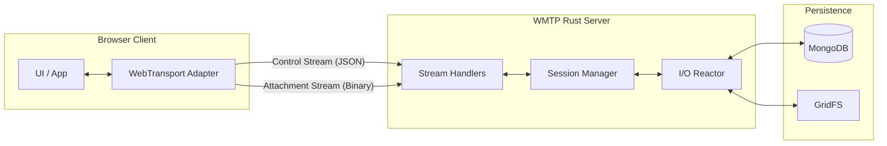

# WMTP - WebTransport Mail Transfer Protocol


A next-generation, secure, low-latency email transfer protocol built on **QUIC** and **WebTransport**. WMTP unifies message submission and retrieval into a single, encrypted, stateful connection, eliminating Head-of-Line (HoL) blocking and high handshake latency.

🌐 **Website:** [https://wmtp-docs.netlify.app/](https://wmtp-docs.netlify.app/)

---

## ✨ Features

- 🚀 **QUIC-Powered** - Native multiplexing via independent data streams (eliminates HoL blocking).
- 🦀 **Rust Core** - High-performance, memory-safe backend built with `tokio` and `wtransport`.
- 🔒 **Always Encrypted** - Mandatory TLS 1.3 with 1-RTT connection establishment.
- 📁 **Dual-Plane Architecture** - Dedicated planes for JSON Control (Low-latency) and Raw Binary Data (High-throughput).
- ⚡ **O(1) Memory Streaming** - Zero-copy attachment handling directly to MongoDB GridFS.
- 📱 **Connection Migration** - Sessions survive IP changes (e.g., switching from Wi-Fi to 5G) seamlessly.
- 🧪 **Full Verification** - 100% audited protocol with 57 commands verified via automated browser testing.

---

## 🏗️ Architecture

WMTP decouples control logic from bulk data transport using a multi-stream approach:



---

## 🚀 Performance Benchmarks

Measured on a single connection over loopback:

- **Handshake Latency**: ~20ms (1-RTT)
- **Avg. Command RTT**: < 4ms
- **Binary Throughput**: 33+ MB/s (Raw binary, no Base64 overhead)
- **Concurrency**: 8,700+ Requests Per Second sustained

---

## 📖 Quick Start

### Prerequisites
- **Rust** 1.75+
- **MongoDB** 6.0+ (running at `localhost:27017`)
- **Modern Browser** (Chrome 97+, Edge 97+, Firefox 114+)

### 1. Setup
```bash
git clone https://github.com/hackersfun369/wmt-protocol.git
cd wmt-protocol
```

### 2. Generate Certs (or use provided)
Ensure `certs/cert.pem` and `certs/key.pem` are present.
```bash
cd certs
# Generate self-signed certs for localhost
# Note: Browsers typically require short-lived or trusted certificates for WebTransport.
openssl req -new -x509 -nodes -keyout key.pem -out cert.pem -days 10 -subj "/CN=localhost"
```

### 3. Run Server
```bash
cd server
cargo run
```

### 4. Run Automated Tests
Open `client/auto_tester.html` in your browser. This will run the full 57-command verification suite.

---

## 📁 Project Structure

```text
wmt-protocol/
├── server/          # Rust WebTransport server (Tokio + Wtransport)
│   └── src/commands # 57 Command Handlers (Mailbox, MSG, Auth, etc.)
├── client/          # Browser client implementation
│   ├── js/          # Transport & Protocol logic
│   └── *.html       # UI, Auto-Tester, Benchmark tool
├── docs/            # Full API Reference & Research Paper
└── certs/           # TLS Certificates
```

---

## 📖 API Reference
The complete specification of all 57 commands is available in [WMTP_API_REFERENCE.html](docs/WMTP_API_REFERENCE.html).

### Example Command
```json
// Request
{
  "cmd": "MSG_GET",
  "data": {
    "session_token": "...",
    "id": "msg_id_123"
  }
}
```

---

## 🙏 Acknowledgments
- **wtransport**: High-level WebTransport server implementation in Rust.
- **tokio**: The asynchronous runtime for the Rust ecosystem.
- **mongodb**: High-performance persistence layer.

Made with ❤️ for the future of email.
